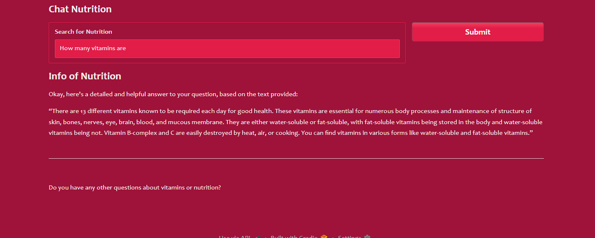

## Chat nutrition 1

## Chat nutrition 2

## Chat nutrition 3


## Nutrition Chatbot
```
This project is a simple, local-based chatbot that provides information on nutrition, specifically focusing on vitamins and other dietary components. The chatbot leverages a Large Language Model (LLM) and a vector database to answer user queries based on a corpus of PDF documents about dietary guidelines and vitamins.
```

## Features
```
Local LLM Integration: Uses the gemma3:1b model from Ollama, allowing for local, offline operation.

Vector-Based Retrieval: Employs a vector database (Chroma) and HuggingFaceEmbeddings to perform semantic search on the uploaded documents, ensuring relevant information is retrieved.

User-Friendly Interface: A simple web interface is built with Gradio, making it easy for users to ask questions and receive answers.

Document Processing: The notebook demonstrates how to load PDF files, split them into manageable chunks, and embed them into a searchable vector store
```

## How It Works
```
The chatbot's architecture follows a common Retrieval-Augmented Generation (RAG) pattern.

Document Loading: The code loads PDF files from a specified directory. In this case, DietaryGuidelinesforNINwebsite.pdf, vitamins-notes.pdf, and Health benifit of fruits & vegetable.pdf are used.

Text Splitting: The loaded documents are broken down into smaller, overlapping chunks to facilitate better information retrieval.

Embedding: The text chunks are converted into numerical vectors (embeddings) using the sentence-transformers/all-MiniLM-L6-v2 model.

Vector Store: These embeddings are stored in a Chroma vector database, which allows for fast similarity searches.

Retrieval: When a user enters a query, the system retrieves the most relevant document chunks from the vector database.

Generation: The retrieved chunks are passed to the gemma3:1b LLM along with the user's question. The LLM then generates a concise and contextually relevant answer.
```
